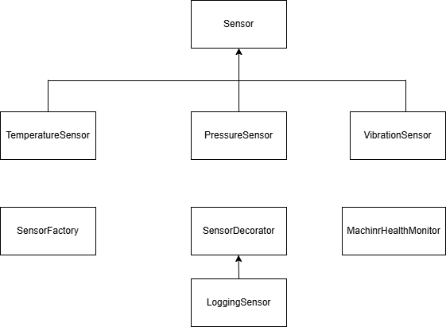

# Predictive Maintenance System

## Problem Description: 

Develop a predictive maintenance application for Caterpillar machinery using simulated sensor data.

## OOP Concepts:

### Abstraction: Create abstract sensor classes like TemperatureSensor, PressureSensor, and VibrationSensor.

### Composition: Combine multiple sensors into a MachineHealthMonitor class.

## Design Patterns: 

Apply the Factory Pattern for creating sensor objects and the Decorator Pattern to add new features like alerts or logging.

## File Handling:

Store machine logs in files for further analysis.

